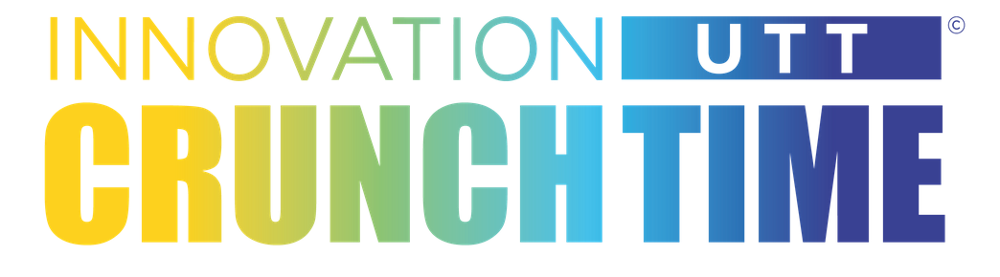
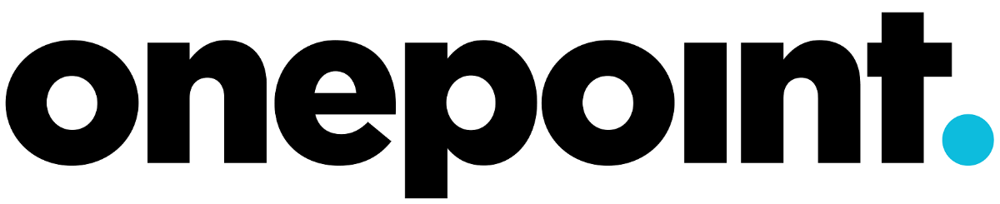
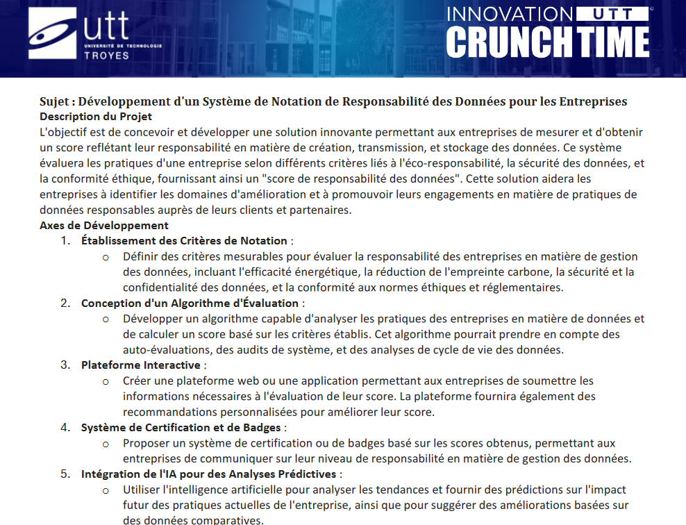
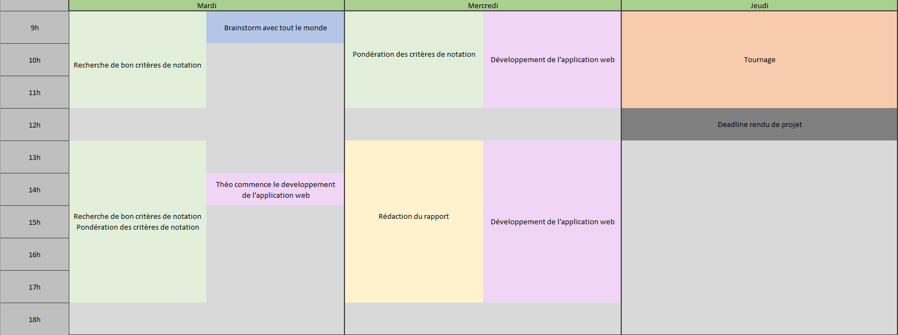

# - 🏗️ Le cadre du projet : Le CRUNCH ... c'est quoi ce truc ? 🚧 -

  
  
Le CRUNCH en quelques mots c'est :
- une entreprise
- 6 étudiants
- une problématique à résoudre
- 3 jours

C'est un évènement auquel les étudiants en première année de spécialisation à l'Université de Technologie de Troyes participent,
et cette année, ça a été notre tour !

L'organisation est simple :

Des entreprises contactent l'université avec des problématiques. Les étudiants choisissent des thématiques sur lesquels ils souhaitent travailler et le jour J,
on les entasse dans un gros hangar où ils essaient en groupe de répondre à la problématique liée à leur thématique choisie, et ceci, le plus efficacement possible.

# - 🏗️ Le cadre du projet : Notre CRUNCH 👨‍👨‍👦‍👦 -

Pour notre CRUNCH, on a tous été membres d'une équipe de choc : 
Pierre-Emeric BOCCARD - Thomas CHABANNES - Louis DELHOMME
Léon HOSPITALIER - Théo KOEHLER - Japhet TANOUO

Cette équipe, c'est 6 étudiants, répartis en trois spécialisations : Réseau Télécom, Informatique et Systèmes d'Information, Systèmes Numériques.
Ca a été super puisque ça a permis une bonne mixité des profils et des compétences.

Pour notre part, on a travaillé pour l'entreprise Onepoint™, une boîte française spécialisée dans la transformation numérique des entreprises.
  
   
  
En quelques chiffres c'est :
- 2500 employés
- plus de 20 ans d'expérience
- 300 millions de CA

Bref, c'est pas Microsoft, mais on ne travaille pas non plus pour le boulanger d'à côté.

En tout cas, ils nous ont bien gâtés avec leur problématique, parce que parmi tous les étudiants du hangar, je crois qu'on est ceux qui ont eu à la fois le
sujet le plus intéressant, mais aussi le plus complexe.  
  
Plutôt que d'expliquer le pourquoi du comment, je vous laisse juger par vous-même :
  
  

Puis, le CRUNCH, c'est techniquement 3 jours, auquels il faut enlever 
- le temps de réalisation d'une vidéo présentant notre solution
- le temps de rédaction d'un rapport
- ah, mais c'est 3 jours qui commencent le mardi, et qui finissent jeudi midi, donc plutôt 2.5 jours

En gros, on a 2 jours pour proposer une solution... Au boulot !

# - ⚙️ Le projet en lui même : Notre organisation 📅 -

On a bien bossé sur ces trois jours, et on s'est bien organisés surtout !  
Sinon, je vois pas comment on aurait pu avoir le temps de finir...

Globalement, on s'est répartis le boulot par pôles. Ici on parle de sécurité, d'éthique et d'impact écologique des données.  
On est 6, il y a 3 thématiques, spécialisons-nous !  
On s'est donc organisés par binômes se spécialisant sur chacun une thématique afin d'en connaître un max sur le sujet.  
  
En même temps de se spécialiser, on a travaillé en parallèle sur plusieurs tâches. On a au début concentré notre travail sur la recherche  
de critères pertinents pour notre notation, puis on s'est penchés sur le dévelopmment de l'application web et l'écriture du rapport.  

Étant donné que l'on avait beaucoup de compétences différentes au sein du groupe, on a essayé d'adapter les compétences de chacun afin d'être le plus efficace.  
C'est pour cela que Théo a très vite commencé l'application web afin de proposer un bon squelette de code puisqu'il était déjà très à l'aise avec  
l'outil que l'on souhaitait utiliser : React.  

Si je devais rétranscrire notre emploi du temps du CRUNCH, je ferai ceci :

  

# - ⚙️ Le projet en lui même : Notre solution 💡 -  

Bon, alors c'est quoi notre solution ?

